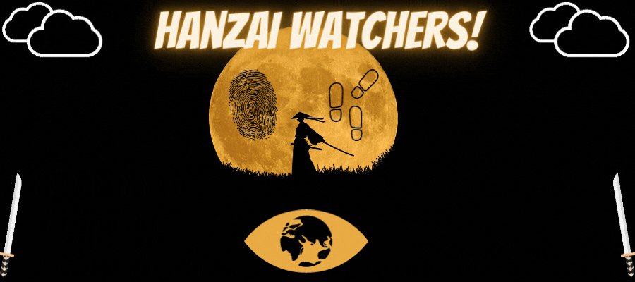
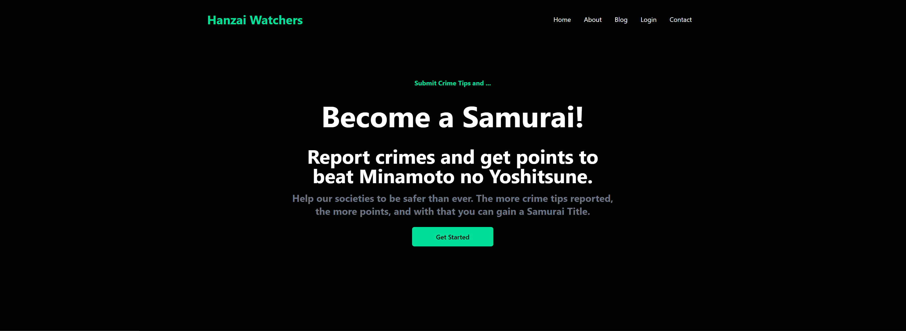

By [Tanya](https://github.com/tanyaleepr), [Ashley](https://github.com/ashleyhodge), [Don-EL](https://github.com/DonL44), and [Paul](https://github.com/pshertzi)

# The Mission

The Hanzai Project, is a Full Stack MERN application that we decided on for our final project to display what we've learned throughout the bootcamp:

The purpose of this application is to report and alert others to crime in your area in hopes of providing awareness in your community. We would like our society to be safer and with the more crime tips reported the more points you earn. With enough points you'll become your community's #1 Samurai! 

# Home Page

# Weapons Used

<ul>
  <li>FrontEnd: <b> React.JS, Redux Library, Bootstrap, HTML/CSS </b></li>
  <li>Backend:  <b> Node.JS, Express.JS </b> </li>
  <li>Database: <b> MongoDB, Mongoose </b> </li>
</ul>

## Installation

You will need `node` and `npm` to install and run this project.

1.  `git clone git@github.com:fbi-cde/crime-data-frontend.git cde && cd cde`
2.  `npm install`

### Running the app locally

The application expects a few environment variables to interact with the API:

* `CDE_API` - this should be the URL for the API. To use the public API, set this to `https://api.usa.gov/crime/fbi/sapi`
* `API_KEY` - this should match the key used by the API. If you are using the public API, sign up for an API key at [https://api.data.gov/signup/](https://api.data.gov/signup/)

You can copy the `env.sample` file (`cp env.sample .env`), fill in your own values, and then make sure to `source .env` before running the build process.

Use `npm run watch` to start the continuous `webpack` processes and a webserver.

### Running tests

You can lint the code with `npm run lint` and run tests with `npm run test`.